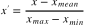
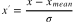

# Bias - Variance Trade-off
- In a bullseye example where target is real values. Predictions have:
  - Low bias - high variance: The predictions are distributed everywhere except the target.
  - High bias - low variance: The predictions are grouped on a spot but not to the target.
  - High bias - high variance: The prediction are distributed on one part of the table.
  - Low bias - low variance (Perfect world): The predictions are on the target.

# K-fold Cross-validation to Avoid Overfitting

- Algorithm:
  - Instead of dividing our data into two buckets, one for training and one for testing, we divide it into K buckets.

  - We reserve one of those buckets for testing purposes, for evaluating the results of our model.

  - We train our model against the remaining buckets that we have, K-1, and then we take our test dataset and use that to evaluate how well our model did amongst all of those different training datasets.

  - We average those resulting error metrics, that is, those r-squared values, together to get a final error metric from k-fold cross-validation.

- `scikit-learn` implements the algorithm in `cross_validation.cross_val_score`

# Data Cleaning and Normalisation

- A dataset may have many problems including:
  - `Outliers`: An example for web sites is that, a test user might be checking the system for every hour and it pollutes the data set. We need to remove such outliers from the data set in advance.

  - `Missing data`: Alternatives to deal with the missing data;
    - Remove instances with missing data.
    - Create a new classification for the instances with missing data.
    - Imputation with mean

  - `Malicious data`: We need to identify shilling attacks (for recommender systems), and filter out any user which malicious activity.

  - `Erroneous data`: There might be errors in software which produce the data. Users on a web sites may drop their session-ids and get a new one.

  - `Irrelevant data`: We might be interested in the data from System A, and not the data from System B.

  - `Inconsistent data`: Text inputs like address may be inconsistent. Some users may use country codes in the phone number and some do not. Uppercase, lowercase may be another example.

  - `Formatting`: Date format is a good example.

# Normalizing Numerical Data

- Depending on the algorithm normalization may or may no matter. E.g. it is not important for linear regression.
- Generally speaking it is important when we need to calculate distance.
- Feature scaling is important for k-nearest neighbors, PCA.
- We can speed up gradient decent with feature scaling.
- It is not important for tree based models, LDA, and Naive Bayes.

## Scaling
- Scales the data into a specific range (0,1)
- 
<!-- https://render.githubusercontent.com/render/math?math=x^%27=\dfrac{x%20-%20x_{min}}{x_{max}%20-x_{min}} --->
- Implemented in: `sklearn.preprocessing.minmax_scale`
- Distribution does not change.

## Normalization
- The normalization formula below also scales between 0 and 1, but it  changes the existing distribution normal (Gaussian) distribution.
- 

## Standardization
- Standartization (also called z-score normalization) typically rescales data to have a mean of 0 and a standard deviation of 1

- 

- \sigma is the standard deviation.

# Finding Outliers with Standard Deviation Method

- `m - n * s < value < m + n * s`
  - `m` is median (mean), and `s` is standard deviation.
  - `n=1` -> Standard Deviation from the Mean: 68%
  - `n=2` -> Standard Deviations from the Mean: 95%
  - `n=3` -> Standard Deviations from the Mean: 99.7%
