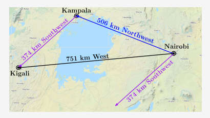
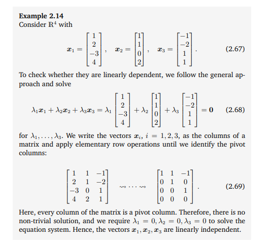

# Math

## Algebra and calculus

### Vectors

- What is the geometric interpretation of the dot product of two vectors?

The dot product tells you what amount of one vector goes in the direction of another.

dot(a, b) is the magnitude of vector a multiplied by the projection (iz dusum 90 degrees) of b on a.

[link1](https://www.youtube.com/watch?v=ZXChzVtIXz0&ab_channel=TutorialsPoint)

[link2](https://www.youtube.com/watch?v=k5hqdAkPYzg&ab_channel=DavidLippman)

- What does it mean for two vectors to be linearly independent?

In linear regression Y variable is the dependent variable and 
X variables are the independent variables.

 A set of vectors is said to be linearly dependent if there is a nontrivial 
 linear combination of the vectors that equals the zero vector. 
 If no such linear combination exists, then the vectors are said to be linearly independent.

Vectors `[Southwest, Northwest]` are linearly independent.
Vectors `[Southwest, Northwest, West]` are linearly dependent.

A practical way of checking whether vectors `x1, . . . , xk ∈ V` are linearly independent
is to use Gaussian elimination: Write all vectors as columns of a matrix A
and perform `Gaussian elimination` until the matrix is in row echelon
form (the reduced row-echelon form is unnecessary here):

See: Mathematics for Machine Learning 2.5 Linear Independence.

- What's a norm? What is  L0,L1,L2,Lnorm ?

Norm is the length/size of a vector. 

The L1 norm that is calculated as the sum of the absolute values of the vector. 
The L2 norm that is calculated as the square root of the sum of the squared vector values.

- How do norm and metric differ? Given a norm, make a metric. 
Given a metric, can we make a norm?

A metric is a function of two variables and a norm is a function of one variable.

### Matrices

- What does the determinant of a matrix represent?

The determinant of a matrix is the factor by which areas are scaled by this matrix.
[see link](https://towardsdatascience.com/what-really-is-a-matrix-determinant-89c09884164c)

-  What’s the difference between the covariance matrix and the Gram matrix?

A Gram matrix is a matrix created by multiplying a matrix with its own transpose.

The rank of  M  and that of the Gram matrix of its columns are equal. 
In particular, if the Gram matrix is invertible, then  M  has full rank, 
so its columns are linearly independent. 
This is what the Gram matrix is usually used for.

 Covariance matrix is a square matrix giving the covariance between each
 pair of elements of a given vector.
 
If one is given, we can calculate the other one.

- What does derivative represent?

The derivative is the instantaneous rate of change of a function
with respect to one of its variables. 
This is equivalent to finding the slope of the tangent line 
to the function at a point.

- What’s the difference between derivative, gradient, and Jacobian?

if you have a function f(x), then the derivative f’(x) or df(x)/dx 
tells you how fast the function is changing at different values of x. 
In other words, the slope of x.

If you have a function f(x, y, z) of several variables, 
you can ask how sensitive the value of the function is to each variable separately. 
These are the partial derivatives \frac{\partial f){\partial x}   
\frac{\partial f){\partial y}  and  \frac{\partial z){\partial x} 

If you draw a graph of f with axes x, y, and z, 
the partial derivatives will tell you how fast f is changing in the 
x direction, in the y direction, and in the z direction.

If you turn the partial derivatives into a vector, you have the gradient  \gradf 

The gradient tells you the direction of the steepest slope of f 
and how steep it is in that direction.

Jacobian is a matrix of partial derivatives that tell you 
how each output of a vector valued function depends on each input.
The Jacobian matrix collects all first-order partial derivatives of a 
multivariate function that can be used for backpropagation.